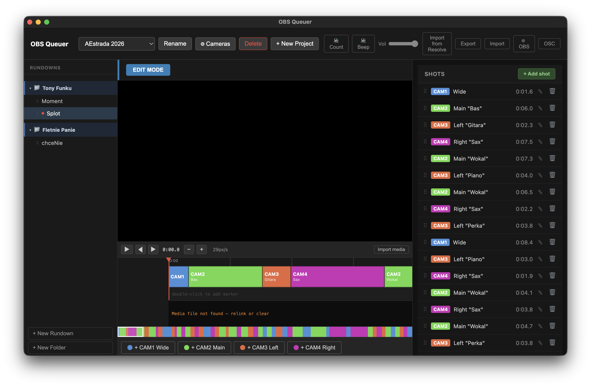
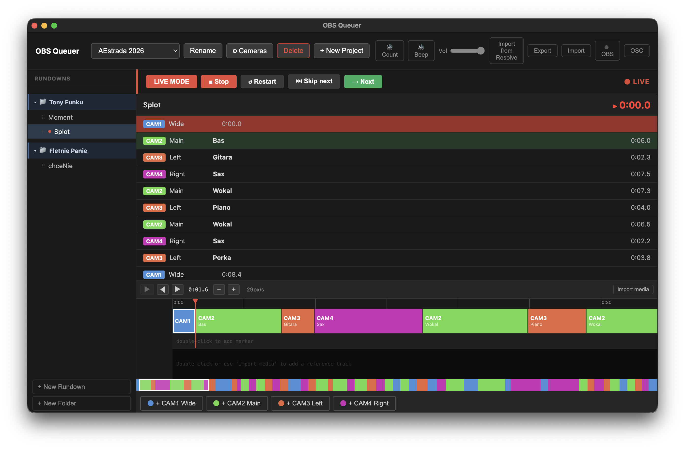

# OBS Queuer

Camera shot queue manager for live productions(something like cuepilot but without the timecode). Runs as an Electron desktop app with an embedded web server so phone browsers on the same LAN can monitor the live shot list.

## Screenshots

### Edit mode
<!-- TODO: add screenshot of edit mode -->


### Live mode
<!-- TODO: add screenshot of live mode -->


## Features

- **Shot list & rundowns** — organize shots into rundowns with per-camera color coding
- **Timeline editor** — visual timeline with drag-to-resize shots, split at playhead, camera assignment
- **Live mode** — advance through shots with progress tracking; skipped shots are hidden in-memory (no DB writes)
- **OBS integration** — switches scenes via obs-websocket; validates studio mode and scene names
- **Phone monitor** — embedded Express + Socket.io server pushes state to LAN browsers in real time
- **OSC server** — accept `/obsque/next` and `/obsque/skip` commands from external controllers
- **DaVinci Resolve import** — import shot list from Resolve CSV marker export
- **Export / Import** — rundown, project, or full database in JSON

## Tech stack

| Layer | Tech |
|---|---|
| Desktop shell | Electron 29 |
| Renderer UI | React 18 + Vite |
| Phone UI | React (separate Vite bundle) |
| State | Zustand |
| Persistence | SQLite via `better-sqlite3` |
| OBS | `obs-websocket-js` |
| Web server | Express + Socket.io + `ws` |
| OSC | `node-osc` |

## Getting started

### Prerequisites

- Node.js 20+
- Yarn 1.x
- OBS Studio with obs-websocket plugin (built-in since OBS 28)

### Install

```bash
yarn install
```

### Development

```bash
yarn dev
```

Starts Electron with Vite hot reload.

### Production build

```bash
yarn build   # compile all targets
yarn dist    # build + package (current platform)

# Platform-specific:
yarn dist:mac
yarn dist:win
yarn dist:linux
```

### Tests

```bash
yarn test        # single run
yarn test:watch  # watch mode
```

### Lint / format

```bash
yarn lint
yarn format
```

## Configuration

All settings are stored in SQLite and configured from the app UI.

| Setting | Where |
|---|---|
| OBS WebSocket host/port/password | Header → OBS button |
| OSC server port | Header → OSC button |
| Camera names, colors, OBS scene mappings | Header → project name → Cameras |
| Web server port | `src/main/server/index.ts` (default `3000`) |

### Phone monitor

Open `http://<machine-ip>:3000` in any browser on the same LAN. The page auto-connects and shows the live shot list with timers.

## OSC server

The embedded OSC server lets external hardware (foot pedals, stream decks via TouchOSC, etc.) control playback.

**Enable:** Header → OSC button → toggle on, set port, Save.

Default port: `8000`
Bind address: `0.0.0.0` (all interfaces)

### Supported messages

| Address | Action |
|---|---|
| `/obsque/next` | Advance to next shot (same as Space) |
| `/obsque/skip` | Skip the next queued shot (same as →) |

No arguments are read — any OSC message to the above address triggers the action.

### Example (Python)

```python
from pythonosc.udp_client import SimpleUDPClient

client = SimpleUDPClient("192.168.1.100", 8000)
client.send_message("/obsque/next", [])
client.send_message("/obsque/skip", [])
```

## Keyboard shortcuts

### Live mode

| Key | Action |
|---|---|
| `Space` | Start / advance to next shot |
| `→` | Skip next shot |

### Edit mode (timeline focused)

| Key | Action |
|---|---|
| `Space` | Play / pause video |
| `1`–`9` | Split at playhead and assign camera number |
| `L` | Stop playback and open label edit for current shot |

## Data model

```
Project
  └── Camera[]  (number, name, color, OBS scene)
  └── Rundown[]
        └── Shot[]  (camera, duration, label, transition)
        └── Marker[]
```

Live progress (current shot index, started-at timestamp) is kept **in memory only** and never written to the database. Stopping live mode discards all progress.

## Architecture

```
OBS ←→ obs-websocket ←→ Electron main ←→ SQLite
                               ↕ IPC
                         Electron renderer (React)
                               ↕ Socket.io / WebSocket
                         Phone browsers (LAN)
```
## TODO


1. add casparcg support
2. add proxy for phones to avoid overstressing video switcher or app which will play audio comunicates 
3. camera filter selector should persists because this is based on the current project not rundown
4.  export specific rundown, project or whole db
5. checkbox do aktualizacji preview
6. Edytor shotów powinien zniknąć i zamiast niego powinien być inspektor z lewej
7. 14. kafelek ustawień
8. 13. niektóre transitions w obs maja fixed duration. domyslnie tylko cut i fade
9. Odtwarzanie video niewydajne - video loading and video managing should be in await or diffrent thread not to harm the main app
10. Usuwanie rundownów/projektów w innym miejscu

11. Checkbox for reexecuting preview doesn't work

12. sometimes audio fires at the same time
13. add audio counting 20, 15, 10, 5

14. editing timeline in live mode should be forgidden
15. waveform generation and video playback on large files
16. When OBS IP is provided, there is no possibility to change it
17. when creating new cameras, automatically assign correct camera colors
18. when switching projects, folders are not refreshed
```
Error occurred in handler for 'media:read-file': RangeError [ERR_FS_FILE_TOO_LARGE]: File size (3180545949) is greater than 2 GiB
    at new NodeError (node:internal/errors:406:5)
    at tryCreateBuffer (node:fs:406:13)
    at Object.readFileSync (node:fs:456:14)
    at t.readFileSync (node:electron/js2c/node_init:2:9771)
    at /Users/michal/IT/obs-queuer/out/main/index.js:1380:15
    at WebContents.<anonymous> (node:electron/js2c/browser_init:2:78397)
    at WebContents.emit (node:events:514:28) {
  code: 'ERR_FS_FILE_TOO_LARGE'
}
```
