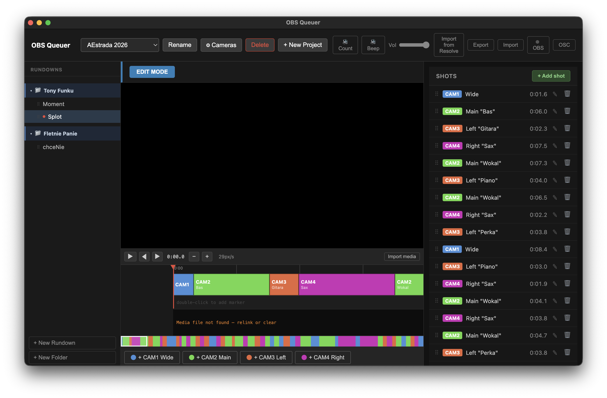
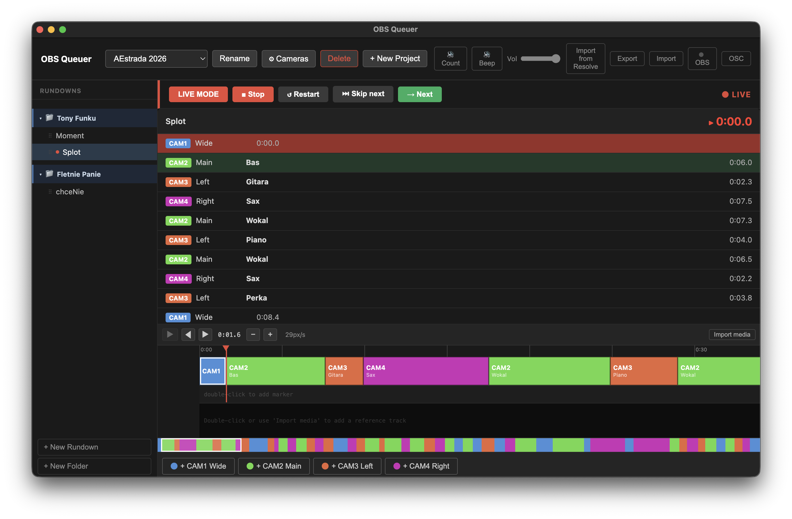

# Shotlister

Camera shot queue manager for live productions(something like cuepilot but without the timecode). Runs as an Electron desktop app with an embedded web server so phone browsers on the same LAN can monitor the live shot list.

A rundown is one of two Kinds. A **Camera Rundown** holds Shots and switches OBS. A **Voice-over Rundown** holds Calls and, instead of switching anything, speaks the next song part and a countdown to the band.

## Screenshots

### Edit mode
<!-- TODO: add screenshot of edit mode -->


### Live mode
<!-- TODO: add screenshot of live mode -->


## Features

- **Shot list & rundowns** — organize shots into rundowns and folders, with per-camera color coding
- **Two rundown kinds** — Camera Rundowns (Shots, OBS) and Voice-over Rundowns (Calls, spoken announcements). Convertible either way; assignments for both kinds are kept, so converting back restores them
- **Timeline editor** — drag-to-resize items, split at playhead, camera or part assignment, markers, and a **Lyrics track** for orientation in the song
- **Reference media** — align an audio/video file to a rundown and edit against its waveform. Files stream in 1 MB chunks, so multi-gigabyte media loads, and decoded peaks are cached between loads
- **Live mode** — advance through items with progress tracking; skipped items are hidden in-memory (no DB writes)
- **Spoken announcements** — a Voice-over Rundown says the part name and a countdown ("gitara za 10, 5, 3, 2, 1") from clips synthesised ahead of the show; nothing is synthesised while a session runs
- **Speech that installs itself** — the Piper engine ships with the app, voice models are downloaded on first use against a pinned catalogue
- **OBS integration** — switches scenes via obs-websocket; validates studio mode and scene names. Never contacted for a Voice-over Rundown
- **Phone monitor** — embedded Express + Socket.io server pushes state to LAN browsers in real time; a Voice-over Rundown shows unfiltered, named by its parts
- **Cue Tray** — small companion app for the video switching computer that plays the countdown and beep over the LAN
- **OSC server** — accept `/obsque/next` and `/obsque/skip` commands from external controllers
- **Two configurable outputs** — each picks a device, what it carries (announcements, cues or both) and how early to play it, so the operator's speakers and a loopback device feeding Mumble are both just outputs
- **DaVinci Resolve import** — import shot list from Resolve CSV marker export
- **Export / Import** — rundown, project, or full database in JSON, carrying kinds, parts, calls and lyrics

## Tech stack

| Layer | Tech |
|---|---|
| Desktop shell | Electron 29 |
| Renderer UI | React 18 + Vite |
| Phone UI | React (separate Vite bundle) |
| State | Zustand |
| Persistence | SQLite via `better-sqlite3` |
| OBS | `obs-websocket-js` |
| Web server | Express + Socket.io |
| OSC | `node-osc` |
| Speech synthesis | Piper (engine bundled per platform, voices fetched at runtime) |

## Getting started

### Prerequisites

- Node.js 20+
- Yarn 1.x
- OBS Studio with obs-websocket plugin (built-in since OBS 28)

### Install

```bash
yarn install
```

### Development

```bash
yarn dev
```

Starts Electron with Vite hot reload.

### Production build

```bash
yarn build   # compile all targets
yarn dist    # build + package (current platform)

# Platform-specific:
yarn dist:mac
yarn dist:win
yarn dist:linux
```

### Tests

```bash
yarn test        # single run
yarn test:watch  # watch mode
```

### Lint / format

```bash
yarn lint
yarn format
```

## Configuration

All settings are stored in SQLite and configured from the app UI.

| Setting | Where |
|---|---|
| OBS WebSocket url/password, scene mappings | Header → **Connections** → OBS |
| OSC server port | Header → **Connections** → OSC |
| Mute countdown, mute beep, cue volume | Header → speaker icon |
| Voice, connector, countdown numbers, phrase placement, auto rendering | Header → speaker icon → **Voice & audio settings…** |
| Output 1 and Output 2 — device, delay, what each carries | Header → speaker icon → **Voice & audio settings…** → Outputs |
| Camera names, colors, OBS scene mappings | Header → **⚙ Project** → Cameras… |
| Parts (voice-over) | Header → **⚙ Project** → Parts… |
| Rename / delete project | Header → **⚙ Project** |
| Import / export, Resolve CSV | Header → **File** |
| Web server port | `src/main/server/index.ts` (default `3000`) |

### Phone monitor

Open `http://<machine-ip>:3000` in any browser on the same LAN. The page auto-connects and shows the live shot list with timers.

## Voice-over rundowns

A Voice-over Rundown announces song **parts** to musicians instead of switching cameras. The
operator drives it exactly as a Camera Rundown — Next and Skip, timers advisory — but the side
effect of Next is a spoken **announcement**, not a scene change. Switch a rundown's kind from the
rundown sidebar; both camera and part assignments survive a conversion, so converting away and
back restores the original.

Parts are the voice-over counterpart of cameras: defined once with a number, a name and a colour,
then referenced by many calls. Define them under **⚙ Project → Parts…**, at project, folder or
rundown scope — scope is additive, so a rundown sees the union of all three (ADR 0006).

### What is spoken

`"<part name> <connector>"` then the countdown numbers — "gitara za 10, 5, 3, 2, 1". The connector
is a per-project word. A call's label is never spoken; it stays a note for the operator.

| Setting | Effect |
|---|---|
| Countdown numbers | Whole numbers 1–60, comma separated. Default `10, 5, 3, 2, 1`. Global, with a per-project override |
| Phrase placement | **Flush** (default) schedules the phrase backwards from the first number so phrase and countdown form one utterance; **Immediate** plays the phrase the moment the previous call goes live |
| Announcement delay (ms) | How long the output route to the band buffers — Mumble adds latency, so the whole utterance is scheduled that much earlier |

A call too short for the full countdown plays from the largest number that still fits; one too
short for even the phrase drops its announcement and is badged on the timeline. Skip cuts an
in-flight announcement off immediately.

### Rendering

All announcement audio is synthesised **ahead of the show** into a content-addressed cache keyed on
(text, voice, engine); a live session only plays existing files (ADR 0005). Clips live in
`speech/` under the app data folder, the downloaded voice models in `piper-voices/` — **Open app
folder** in the settings panel opens it.

Each part reports a render state — rendered, stale or never rendered. With **Auto rendering** on,
anything unrendered is synthesised in the background shortly after it appears: after an edit, a
voice change, opening a project, or app start. Off, nothing is synthesised until asked, which is
what a slow machine wants mid-edit. Unrendered parts raise a warning strip in the top bar; a
session still starts, and those parts stay silent (ADR 0002).

The **Render status** section offers *Render all missing* for the whole project, *Clean unused* for
clips no project points at, and *Delete this project's recordings* for an archived project.

No voice ships inside the app (ADR 0007). A model is fetched the first time a render needs it,
verified against a pinned Hugging Face revision. Default is `pl_PL-mc_speech-medium`; the voice is
a global setting with a per-project override.

### Elsewhere

- **Phone view** shows a Voice-over Rundown unfiltered — there are no cameras to filter by
- **Cue Tray** goes silent for a Voice-over Rundown; the announcement is the cue
- **OBS** is never contacted, and **Resolve CSV import** is refused
- **OSC** is unchanged — Next and Skip behave identically

See `specs/voice-over-rundowns.md` and `specs/lyrics-track.md` for the full behaviour.

## Cue Tray

The switcher operator sits at a different machine from the shot list and would otherwise
hear nothing. The Cue Tray is a small standalone program for that machine: it connects to
this app over the LAN and plays the same audio cues the operator window plays — the spoken
"three / two / one" countdown and the beep at shot expiry.

It is read-only. It never sends anything back, and this app needs no configuration to
support it. It stays silent for a Voice-over Rundown, whose announcements are played by the
app itself. Source lives in `tray/`; it is a Rust program built with cargo, not part of the
Electron bundle. Release builds ship as `shotlister-tray-*` assets alongside the app.

### Running it

```bash
shotlister-tray --host 192.168.1.20              # tray icon + settings window
shotlister-tray --headless --host 192.168.1.20   # no GUI, for a service or startup script
shotlister-tray --play-test                      # play every cue once and exit
```

Point it at the machine running Shotlister, on the same port the phone monitor uses
(`3000` by default). Left-click the tray icon for the settings window; right-click for
Settings and Quit.

### Command line

| Flag | Description |
|---|---|
| `--host <HOST>` | Address of the machine running Shotlister. Accepts `10.0.0.5`, `10.0.0.5:3000`, or a pasted `http://10.0.0.5:3000` |
| `--port <PORT>` | Port the server listens on. Default `3000` |
| `--volume <LEVEL>` | Playback volume, `0.0` to `1.0`. Default `1.0` |
| `--mute-count` | Start with the spoken countdown muted |
| `--mute-beep` | Start with the expiry beep muted |
| `--headless` | No window and no tray icon. Logs link and cue state to stdout; exits cleanly on `SIGTERM`. Requires `--host` |
| `--settings` | Open the settings window at startup, for desktops with no system tray |
| `--play-test` | Play every cue once and exit. Verifies audio without needing a network |
| `--config <PATH>` | Use this config file instead of the default location |
| `-v`, `--verbose` | Log every state event as it arrives |
| `-h`, `--help` | Print help |

Every setting the window offers is also a flag. **Flags override the config file but never
rewrite it**, so a startup script's arguments cannot silently undo what somebody chose in
the window. `--mute-count` and `--mute-beep` only ever mute — they cannot unmute a saved
setting.

Settings persist per user:

| OS | Path |
|---|---|
| Linux | `~/.config/shotlistertray/config.json` |
| macOS | `~/Library/Application Support/dev.shotlister.ShotlisterTray/config.json` |
| Windows | `%APPDATA%\shotlister\ShotlisterTray\config\config.json` |

### Where the icon appears

| OS | Placement |
|---|---|
| Linux Mint (Cinnamon / MATE / Xfce) | Panel system tray, bottom-right. Works out of the box |
| GNOME | Needs the AppIndicator extension; without an SNI host the item never appears |
| macOS | Menu bar, top-right. No Dock icon |
| Windows | Notification area; may sit behind the `^` overflow until pinned |

Closing the window hides it. If no system tray is available the window stays on screen and
closing it quits, so the program can never become something you can neither see nor stop.

See `tray/README.md` for building it and for how the cue timing is kept identical to the
operator window.

## Outputs

The app plays into two outputs, and each one says three things: which **device** it reaches, how
long that route takes to get there (its **delay**), and what it **carries** — announcements,
countdown and beeps, or both.

**Output 1** is your own. It is always on, it is the copy the mute buttons silence, and it is the
only one that falls back to the system default when its device disappears. **Output 2** has a
switch and is a second listener — typically a loopback device a voice client picks up as a
microphone and carries to the band.

They **duplicate**, never divide: nothing is taken away from your own speakers. Reference media is
never routed, so scrubbing a rehearsal video does not reach the band. Muting the countdown or the
beep silences your own copy only — output 2 keeps its feed, exactly as the Cue Tray does.

A **delay plays a sound earlier**, not later. Mumble buffers, so a clip is heard well after it is
played: set output 2's delay to what its route costs and everything that output carries — the
spoken part name and the countdown beep alike — is played that much ahead, and lands on the beat.
Your own speakers need no delay.

**Set up:** Header → speaker icon → **Voice & audio settings…** → Outputs → switch output 2 on,
pick the device, type its delay, choose what it carries, press **Test**.

### Where the device comes from

| Platform | Device | Select in Mumble |
|---|---|---|
| Linux (PipeWire / PulseAudio) | Created by the app as **Shotlister Out** | *Monitor of Shotlister Out* |
| macOS | BlackHole (`brew install blackhole-2ch`) or Loopback — installed by you | that device |
| Windows | VB-CABLE (vb-audio.com) or VoiceMeeter — installed by you | *CABLE Output* |

Only Linux lets an app create a loopback device at runtime; macOS wants a signed Core Audio
plug-in and Windows a driver, so there the app detects a known device, marks it *— loopback* in the
picker, and tells you what to install when there is none. It never runs an installer. See
`docs/adr/0008-the-virtual-output-is-created-only-where-the-os-allows-it.md`.

On Linux the sink is created at start and removed at quit:

```bash
pactl load-module module-null-sink \
  sink_name=shotlister_out \
  sink_properties=device.description="Shotlister Out"
```

An existing `shotlister_out` is reused rather than duplicated, and only a sink this app loaded is
unloaded again — one you set up by hand outlives the app.

A device that disappears mid-show costs output 2 its copy and nothing else: output 1 keeps playing,
and output 1 is the only one that falls back to the system default. Full behaviour in
`specs/outputs.md`.

## OSC server

The embedded OSC server lets external hardware (foot pedals, stream decks via TouchOSC, etc.) control playback.

**Enable:** Header → OSC button → toggle on, set port, Save.

Default port: `8000`
Bind address: `0.0.0.0` (all interfaces)

### Supported messages

| Address | Action |
|---|---|
| `/obsque/next` | Advance to next shot (same as Space) |
| `/obsque/skip` | Skip the next queued shot (same as →) |

No arguments are read — any OSC message to the above address triggers the action.

### Example (Python)

```python
from pythonosc.udp_client import SimpleUDPClient

client = SimpleUDPClient("192.168.1.100", 8000)
client.send_message("/obsque/next", [])
client.send_message("/obsque/skip", [])
```

## Keyboard shortcuts

### Live mode

| Key | Action |
|---|---|
| `Space` | Start / advance to next shot |
| `→` | Skip next shot |

### Edit mode (timeline focused)

| Key | Action |
|---|---|
| `Space` | Play / pause reference media |
| `←` / `→` | Nudge playhead 1 s (`Shift` for 10 s) |
| `Ctrl`/`Cmd` `+` / `-` | Zoom in / out |
| `M` | Add marker at playhead |
| `[` / `]` | Lyrics: set In / Out at the playhead — opens a new line, or corrects the selected one |
| `L` | Stop playback and open label edit for the current item |
| `1`–`9` | Camera Rundown: split at playhead and assign camera number |
| `1`–`9`, `q w e r t y u i o p` | Voice-over Rundown: split at playhead and assign one of the first nineteen parts in scope |
| `N` | Voice-over Rundown: add a new part (rundown scope) |

Nothing on this list edits the rundown while a live session is running, and modified keys
(`Cmd`/`Ctrl`/`Alt` combinations) are left to the OS. A lyric's edges can also be dragged, clamped
against their neighbours.

## Data model

```
Project
  ├── Camera[]   (number, name, color, OBS scene)
  ├── Part[]     (number, name, color; project / folder / rundown scope)
  └── Rundown[]  (kind: camera | voice)
        ├── Shot[] / Call[]  (camera or part, duration, label, transition)
        ├── Lyric[]          (in, out, text — disjoint, never spoken)
        └── Marker[]
```

Shots and calls share one table; the rundown's kind decides which target column is read.
Rendered announcement clips are recorded in `speech_clips`, keyed by the hash of (text, voice,
engine).

Live progress (current shot index, started-at timestamp) is kept **in memory only** and never written to the database. Stopping live mode discards all progress.

## Architecture

```
OBS ←→ obs-websocket ←→ Electron main ←→ SQLite
                          │    ↕ IPC     └→ speech cache (Piper renders, voice models)
                          │  Electron renderer (React) → cue + announcement output devices
                          │         ↕ Socket.io / WebSocket
                          └──→ Phone browsers (LAN), Cue Tray
```

Reference media reaches the renderer over a `media://` protocol handler that streams in 1 MB
chunks and honours range requests, so a multi-gigabyte file plays without being read into memory.
Decoded waveform peaks are cached per file in the app data folder, not in the database — they are
derived from a file on this machine.

## Diagnostics

Playback feeling laggy has three different causes that feel identical. The playback probe
separates them; it is off unless switched on from the renderer console, so a packaged build can
report:

```js
localStorage.setItem('obs-queuer-playback-probe', '1')  // then reload
```

It logs renders/s, frames/s and dropped video frames once a second: renders/s far above the commit
rate means the React budget is blown, low frames/s means the main thread is saturated, climbing
dropped frames means the media pipeline cannot keep up.
## TODO

1. add casparcg support
2. add proxy for phones to avoid overstressing video switcher or app which will play audio comunicates
3. camera filter selector should persists because this is based on the current project not rundown
4. checkbox do aktualizacji preview
5. Checkbox for reexecuting preview doesn't work
6. Edytor shotów powinien zniknąć i zamiast niego powinien być inspektor z lewej
7. kafelek ustawień
8. niektóre transitions w obs maja fixed duration. domyslnie tylko cut i fade
9. Usuwanie rundownów w innym miejscu
10. sometimes audio fires at the same time
11. When OBS IP is provided, there is no possibility to change it (only editable while disconnected)
12. when creating new cameras, automatically assign correct camera colors
13. when switching projects, folders are not refreshed
